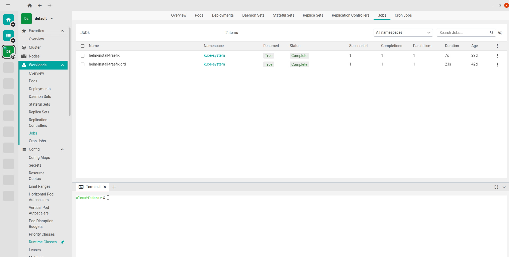
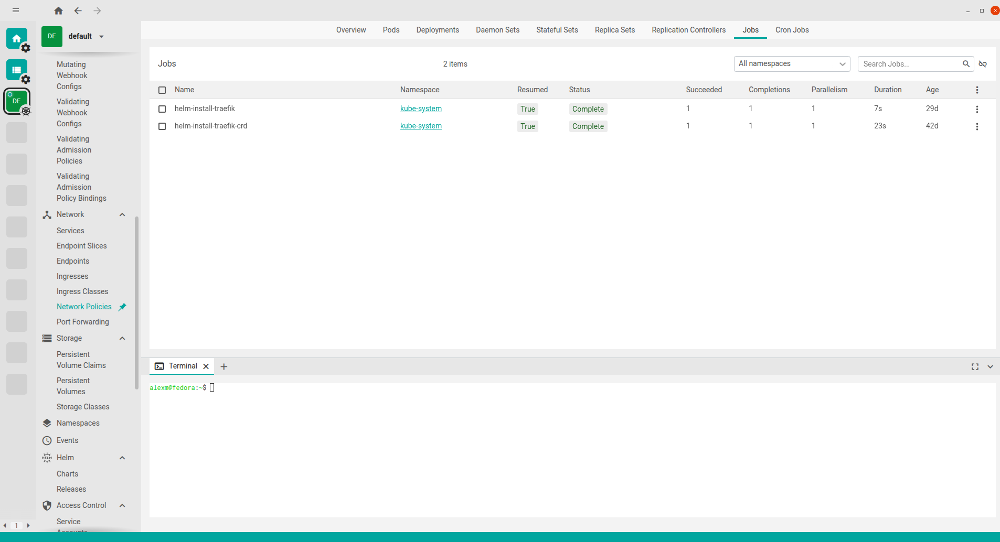
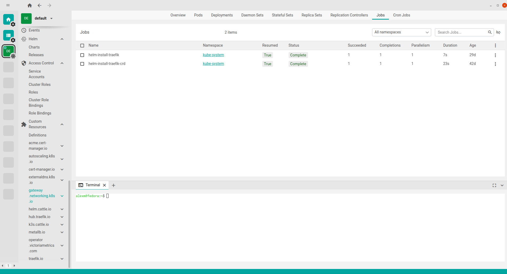

# Freelens reference deck

A captioned walkthrough of Freelens's UI, mapping each surface to how kweblens implements it. This
is the design reference the dashboard was built against (see `freelens-ia.md` for the full IA map).

> Source of the captures: real Freelens sessions against a live cluster. Headless capture on the
> build machine is documented below but not usable there (see "Capturing headlessly").

---

## 1 · Resource list view (Workloads → Jobs)



The core pattern every kind reuses: a **cluster rail** (far left), a **collapsible category nav**,
a **per-category tab bar** (Overview · Pods · … · Jobs · CronJobs), and a **resource table** with a
namespace filter, search, column-visibility toggle, multi-select, status pills, and a per-row menu.
A **dockable terminal** sits at the bottom.

**kweblens (shipped):** one reusable resource-list component driven by the declarative `NavCatalog`;
namespace filter + status pills + per-row actions (yaml / logs / exec). The generic access path
(`ResourceService`) renders 20+ kinds through one code path.

## 2 · Left navigation — Config → Network → Storage → Helm → Access Control



The category tree: **Config** (ConfigMaps … admission-policy/webhook configs), **Network**
(Services … Port Forwarding), **Storage** (PVCs / PVs / StorageClasses), **Namespaces**, **Events**,
**Helm** (Charts / Releases), **Access Control**.

**kweblens (shipped):** the same categories in `NavCatalog`; **Events**, **Helm** (via jhelm), and
**Metrics/Diagnose** are dedicated pages reached from the nav.

## 3 · Custom Resources (CRD-driven, grouped by API group)



Access Control (Service Accounts, Cluster Roles, Roles, Bindings) then **Custom Resources**:
a `Definitions` item plus one expandable sub-group **per API group** (cert-manager.io,
gateway.networking.k8s.io, traefik.io, …) — generated from the cluster's installed CRDs, not static.

**kweblens:** Access Control is in `NavCatalog`; **dynamic CRD discovery** (grouping by
`spec.group`) is the remaining follow-up on issue #12. The generic access path already lists any CRD
kind by descriptor, so only the nav generation is left.

---

## Capturing headlessly (xvfb) — procedure + limitation

Freelens is an Electron desktop app. On a machine with a compositing window manager and
`xdotool`/`xwininfo`, a deck can be scripted:

```bash
xvfb-run -a -s "-screen 0 1600x1000x24" bash -c '
  /opt/Freelens/freelens --no-sandbox --use-gl=swiftshader &   # launch headless
  sleep 12                                                       # let the window load
  WID=$(xdotool search --name Freelens | head -1)               # target the window
  import -window "$WID" freelens-catalog.png                     # capture (needs the window id)
  # xdotool key/click to navigate to Workloads/Helm, capture each view
'
```

**Blocked on this build machine:** `xdotool`/`xwininfo` are not installed and there is no
compositing WM, so `import -window root` captures a black frame (Electron doesn't paint to the bare
X root). Finish this on a machine with those tools, or capture from a real desktop session (as the
screenshots above were). Do not commit black frames.
